# Azentiq Memory Manager Architecture

## Overview

Azentiq Memory Manager is a Python 3.11+ library that provides memory management capabilities for AI applications. The core focus is on maintaining different tiers of memories with efficient storage, retrieval, and token budget management. The MVP implementation focuses on session memory via Redis with a CLI demo.

## System Architecture


## Component Relationships

```mermaid
classDiagram
    class MemoryManager {
        +RedisStore redis_store
        +TokenBudgetManager token_budget_manager
        +set_context(component_id)
        +add_memory(content, metadata, tier)
        +get_memory(memory_id, tier)
        +list_memories(tier, session_id)
        +search_by_metadata(query, tier)
        +generate_prompt(session_id, query)
    }
    
    class Memory {
        +String memory_id
        +String content
        +Dict metadata
        +Float importance
        +MemoryTier tier
        +DateTime created_at
        +DateTime last_accessed_at
    }
    
    class MemoryTier {
        <<enumeration>>
        SHORT_TERM
        WORKING
        LONG_TERM
    }
    
    class RedisStore {
        +set_context(component_id)
        +add(memory, session_id)
        +get(memory_id, tier_str, session_id)
        +update(memory, session_id)
        +delete(memory_id, tier_str, session_id)
        +list(tier_str, session_id)
        +search_by_metadata(query, limit, tier_str)
    }
    
    class TokenBudgetManager {
        +TokenEstimator estimator
        +MemorySelector selector
        +Set~AdaptationStrategy~ strategies
        +PromptConstructor prompt_constructor
        +set_context(component_id, session_id)
        +estimate_tokens(text)
        +select_memories(memories, max_tokens)
        +construct_prompt_with_memories(...)
    }
    
    class TokenEstimator {
        +estimate_tokens(text)
        +estimate_memory_tokens(memory)
        +estimate_memories_tokens(memories)
    }
    
    class MemorySelector {
        <<interface>>
        +select_memories(memories, max_tokens)
    }
    
    class PriorityMemorySelector {
        +select_memories(memories, max_tokens)
    }
    
    class RelevanceMemorySelector {
        +select_memories(memories, max_tokens)
    }
    
    class AdaptationStrategy {
        <<interface>>
        +adapt_memories(memories, target_tokens)
    }
    
    class ReduceAdaptationStrategy {
        +adapt_memories(memories, target_tokens)
    }
    
    class SummarizeAdaptationStrategy {
        +adapt_memories(memories, target_tokens)
    }
    
    class PrioritizeTierStrategy {
        +adapt_memories(memories, target_tokens)
    }
    
    class MemoryFormatter {
        +format_memory(memory, index)
        +format_memories(memories, section_title)
    }
    
    class PromptConstructor {
        +TokenEstimator token_estimator
        +construct_prompt(user_input, memory_sections)
    }
    
    MemoryManager *-- RedisStore : uses
    MemoryManager *-- TokenBudgetManager : uses
    MemoryManager --> Memory : manages
    MemoryManager --> MemoryTier : uses
    
    TokenBudgetManager *-- TokenEstimator : uses
    TokenBudgetManager *-- MemorySelector : uses
    TokenBudgetManager *-- AdaptationStrategy : uses
    TokenBudgetManager *-- PromptConstructor : uses
    
    Memory --> MemoryTier : has
    
    MemorySelector <|.. PriorityMemorySelector : implements
    MemorySelector <|.. RelevanceMemorySelector : implements
    
    AdaptationStrategy <|.. ReduceAdaptationStrategy : implements
    AdaptationStrategy <|.. SummarizeAdaptationStrategy : implements
    AdaptationStrategy <|.. PrioritizeTierStrategy : implements
    
    PromptConstructor *-- MemoryFormatter : uses
    PromptConstructor *-- TokenEstimator : uses
```



## Memory Namespacing


## Data Flow


## Implementation Guidelines

### MVP Focus

The initial implementation (MVP) focuses on:

1. **Single Memory Tier**: Implement session memory via Redis
2. **CLI Demo**: Create a command-line interface for demonstrating core functionality
3. **Core API**: Implement the essential memory operations (add, get, list, search)
4. **Prompt Construction**: Include basic token management and prompt construction

### Storage Implementation

The Redis storage implementation will use the following approach:

- **Session-based Storage**: All memories are stored with session identifiers
- **Namespacing**: Keys follow the pattern `{tier}:{session_id}:{framework}:{component_id}:{memory_id}`
- **TTL Management**: Different memory tiers have different Time-To-Live values
  - Short-term: 1 hour
  - Working: 1 day
  - Long-term: 30 days (configurable)

### Token Budget Management

Token budget management is critical for effective prompt construction:

1. **Token Estimation**: Uses a configurable estimator for accurate token counting
2. **Memory Selection**: Prioritizes memories based on importance and recency
3. **Adaptation Strategies**: Implements methods to fit within token constraints
4. **Format Templates**: Supports customizable templates for memory formatting

### API Design

The API is designed to be intuitive and flexible:

```python
# Initialize memory manager
manager = MemoryManager(redis_url="redis://localhost:6379/0")

# Set context for component
manager.set_context(component_id="my_component")

# Add memory
memory_id = manager.add_memory(
    content="Important information to remember",
    metadata={"importance": 0.9, "category": "user_preference"},
    tier=MemoryTier.WORKING,
    session_id="user_session_123"
)

# Retrieve memory
memory = manager.get_memory(
    memory_id=memory_id,
    tier=MemoryTier.WORKING,
    session_id="user_session_123"
)

# Generate prompt with memories
prompt = manager.generate_prompt(
    session_id="user_session_123",
    query="What do you remember about my preferences?",
    system_message="You are an assistant with memory capabilities."
)
```

## Technology Stack

- **Python 3.11+**: Required for all development and usage
- **Redis**: Primary storage for session memory tier
- **Packaging**: Standard Python packaging with pyproject.toml
- **Testing**: Comprehensive unit tests with pytest

## Extension Points

The architecture supports future extensions:

1. **Framework Adapters**: LangChain and LangGraph adapters
2. **Additional Memory Tiers**: Support for more specialized memory types
3. **Vector Storage**: Integration with vector databases for semantic search
4. **Advanced Selection**: Enhanced selection algorithms based on relevance

## Future Roadmap

After the MVP release, planned enhancements include:

1. **LangChain Adapter**: Integration with LangChain ecosystem
2. **LangGraph Adapter**: Integration with LangGraph for stateful workflows
3. **Vector Store Integration**: Add support for semantic search and retrieval
4. **Improved Selection**: More sophisticated memory selection algorithms
5. **Memory Analytics**: Tools for analyzing memory usage and patterns

## Testing Strategy

The system will be tested with:

1. **Unit Tests**: Testing individual components in isolation
2. **Integration Tests**: Testing interactions between components
3. **AI Agent Tests**: Using Claude, GPT-4o, and Windsurf for real-world usage scenarios
4. **Performance Tests**: Validating performance under various memory loads
