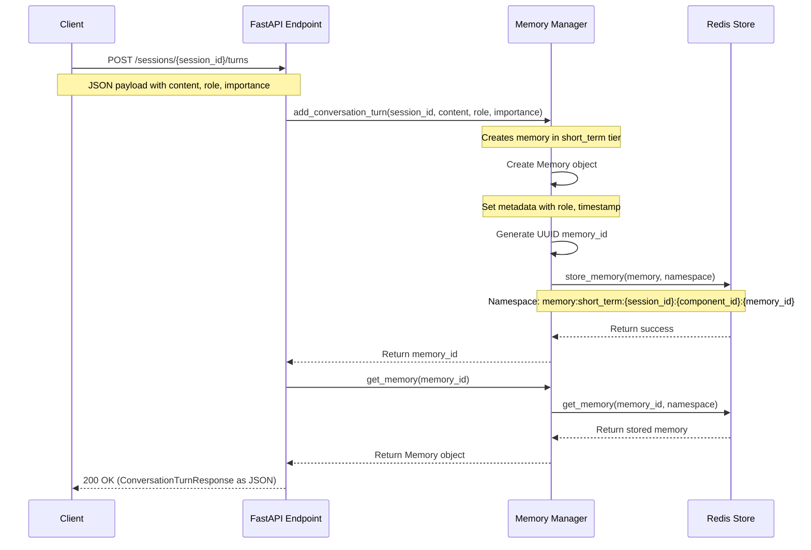
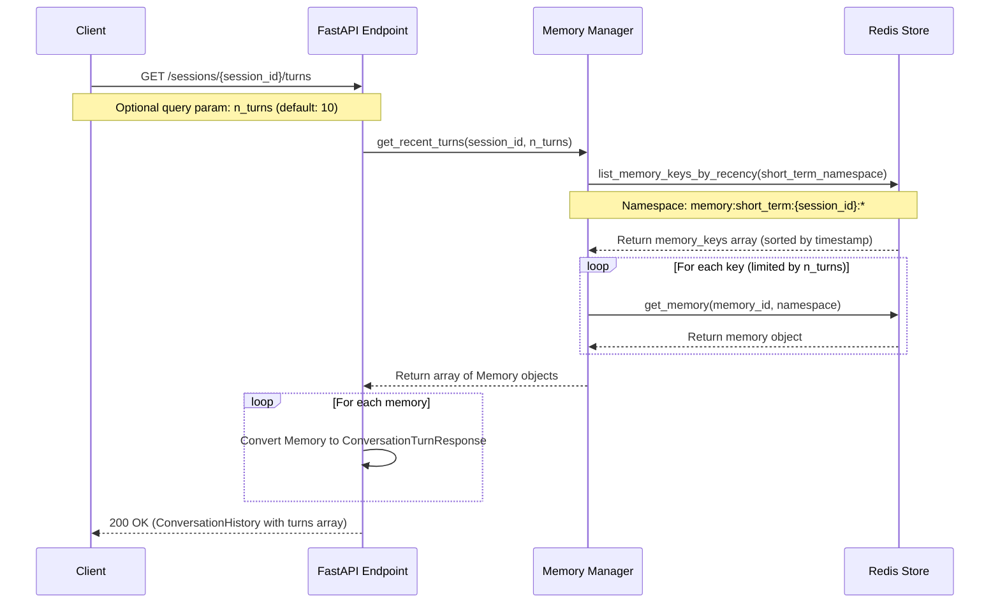
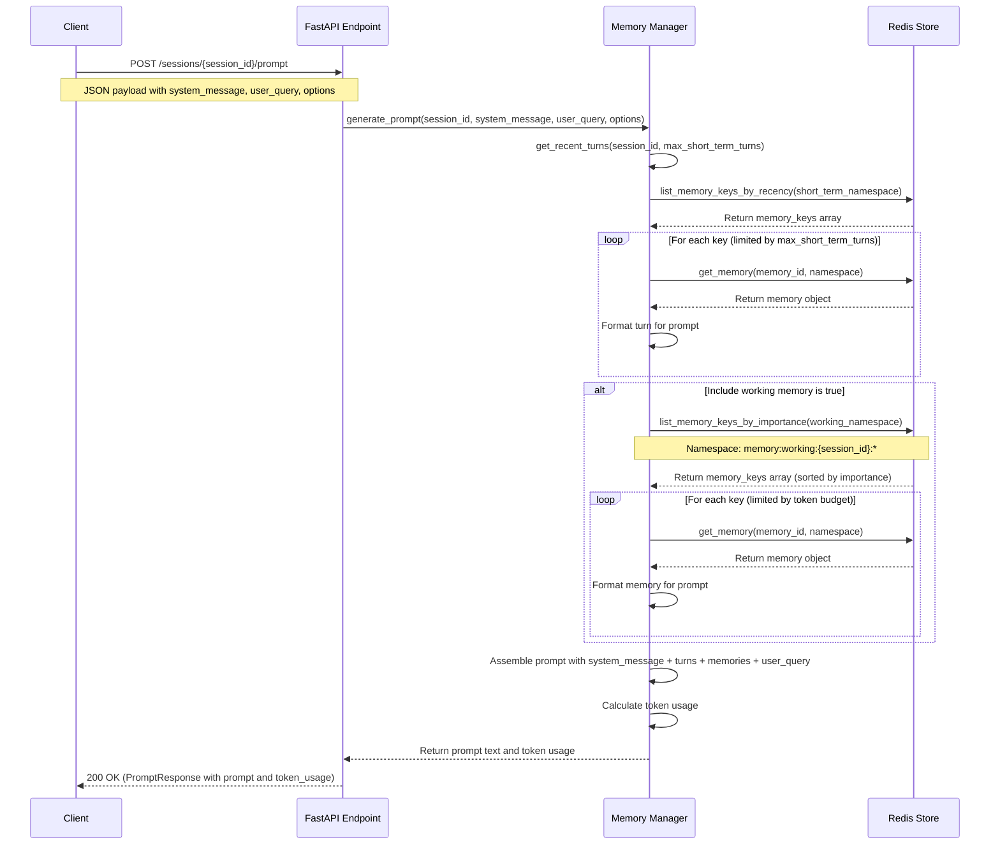

# Conversation Management Sequence Diagrams

This document illustrates the sequence flows for conversation management operations in the Azentiq Memory Manager API.

## Add Conversation Turn Sequence



## Get Recent Turns Sequence



## Generate Prompt Sequence



## Key Implementation Details

### Conversation Turn Storage

Conversation turns are stored as Memory objects in the short_term tier with special metadata:

```json
{
  "content": "This is a message",
  "metadata": {
    "type": "conversation_turn",
    "role": "user", // or "assistant", "system"
    "timestamp": "2025-07-28T18:23:12.858597",
    "session_id": "session_id",
    "component_id": "component_id"
  },
  "tier": "short_term",
  "importance": 0.7,
  "ttl": 86400, // optional TTL in seconds
  "memory_id": "uuid-string"
}
```

### Prompt Construction

The Memory Manager constructs prompts using this general template:

```
{system_message}

Recent conversation history:
{turn 1 role}: {turn 1 content}
{turn 2 role}: {turn 2 content}
...

Relevant memories:
- {memory 1 content}
- {memory 2 content}
...

{user role}: {user_query}
```

### Memory Ranking for Prompt Integration

For working memory integration in prompts, memories are selected based on:

1. Importance score (higher scores are prioritized)
2. Recency (newer memories are prioritized)
3. Token budget constraints (to prevent exceeding model context windows)

This ensures the most relevant context is included in the prompt.
