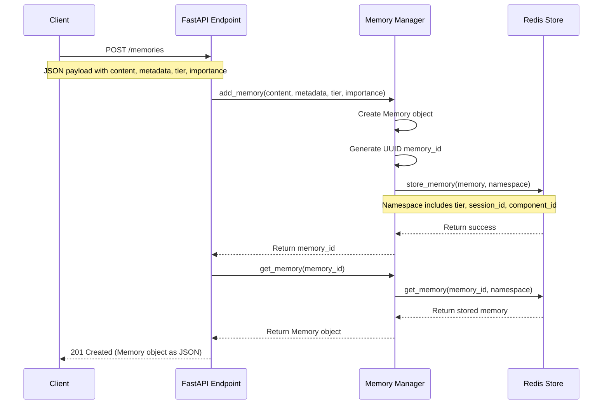
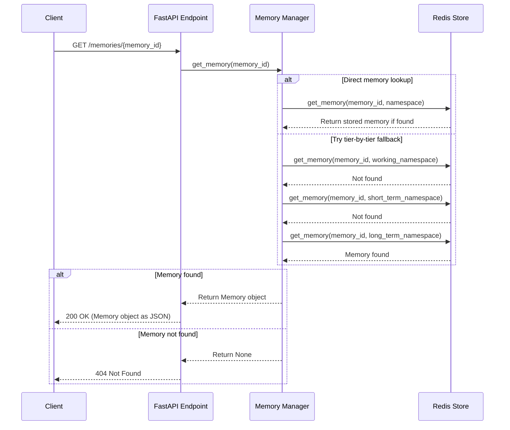
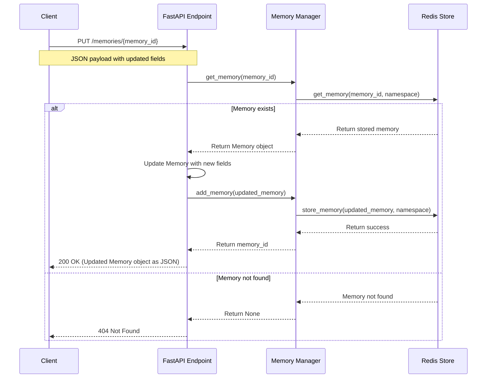
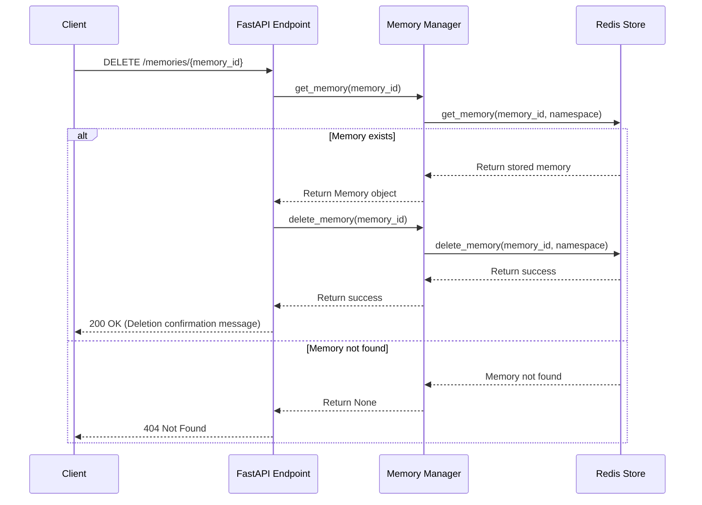
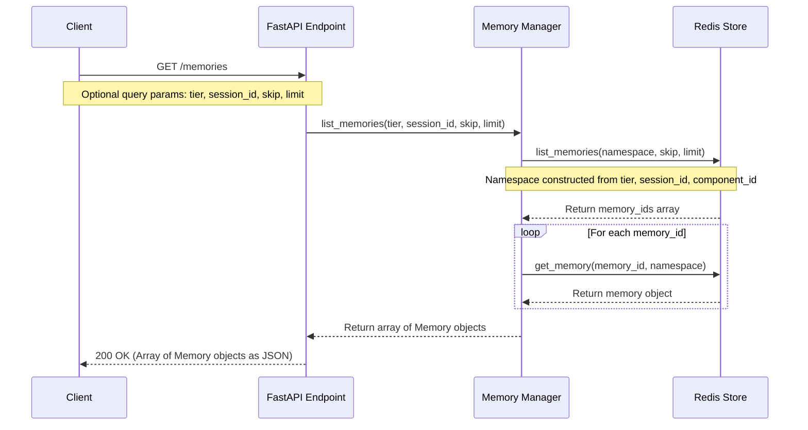

# Memory CRUD Operations Sequence Diagrams

This document illustrates the sequence flows for memory CRUD (Create, Read, Update, Delete) operations in the Azentiq Memory Manager API.

## Create Memory Sequence



## Read Memory Sequence



## Update Memory Sequence



## Delete Memory Sequence



## List Memories Sequence



## Key Implementation Details

### Namespace Construction

The namespace used for Redis key generation is critical for proper memory storage and retrieval:

```
memory:{tier}:{session_id}:{component_id}:{memory_id}
```

For example:
```
memory:working:default:main:04c169ca-2a45-44b3-9338-63fada870dad
```

### Memory Storage Types

- **Short-term memory**: Recent conversation turns and ephemeral context
- **Working memory**: Important facts, preferences, and session state
- **Long-term memory**: Persistent knowledge and information

### Error Handling

- If Redis connectivity fails, a 500 Internal Server Error is returned
- If a memory is not found during read/update/delete, a 404 Not Found is returned
- If invalid parameters are provided, a 400 Bad Request is returned
